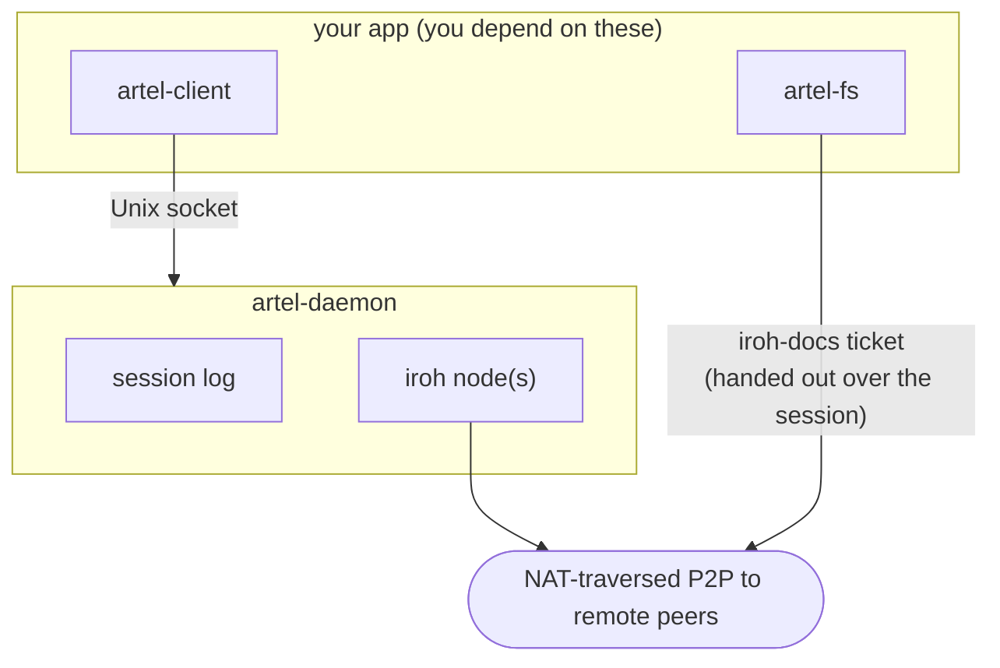

# artel

[](https://github.com/svozza/artel/actions/workflows/ci.yml)

Peer-to-peer collaboration for Rust apps — sessions, messaging, and file sync between machines, with no server to deploy.

Your app depends on one crate, talks to a local daemon over a Unix socket, and gets:

- **Sessions** you can host or join with a shareable ticket — no accounts, no signaling server.
- **NAT-traversed P2P messaging** between peers, built on [iroh](https://iroh.computer).
- **Persistence**: the daemon keeps a per-session message log on disk, so sessions survive app restarts and messages can be replayed.
- **File sync** (optional): mirror a directory across all peers in a session.
- **Capabilities**: admit peers as read-only or read-write, enforced below your app.

The daemon auto-spawns on first connect, so a single-binary app "just works" — nothing for your users to install or run first.

## Quick start

artel is not on crates.io yet; depend on it by git:

```toml
[dependencies]
artel-client = { git = "https://github.com/svozza/artel.git", rev = "<commit-sha>" }
artel-fs     = { git = "https://github.com/svozza/artel.git", rev = "<commit-sha>" }  # only if you want file sync
```

<details>
<summary>Developing your app and artel side by side? Use a path dependency instead.</summary>

```toml
[dependencies]
artel-client = "0.0.0"
artel-fs     = "0.0.0"

[patch.crates-io]
artel-client = { path = "../artel/crates/artel-client" }
artel-fs     = { path = "../artel/crates/artel-fs" }
```

</details>

### Host a session and send messages

```rust
use artel_client::{Client, SpawnOptions};
use artel_protocol::{Request, Response};

// Connect to the daemon, auto-spawning it if not already running.
let client = Client::connect_or_spawn(SpawnOptions::default()).await?;

// Host a session; get back a session id and a shareable ticket.
let resp = client.request(Request::HostSession {
    display_name: "alice".into(),
    session: None, // None = mint a fresh id; Some(id) = resume a known one
}).await?;
let (session, ticket) = match resp {
    Response::HostSession { session, ticket, .. } => (session, ticket),
    other => panic!("unexpected: {other:?}"),
};

// Subscribe to the session's event stream and send a message.
client.request(Request::Subscribe { session, since: None }).await?;
client.request(Request::Send { session, payload }).await?; // payload: app-chosen bytes
let mut events = client.take_events().await.expect("event stream");
while let Some(event) = events.recv().await { /* render */ }
```

Share the ticket however you like (paste it in Slack, print it to a terminal). The other side joins with it:

```rust
client.request(Request::JoinSession {
    display_name: "bob".into(),
    ticket,
}).await?;
```

Message payloads are opaque bytes — artel gives you ordering, delivery, persistence, and replay; the schema is yours.

### Sync files across peers

Add `artel-fs` to mirror a directory to everyone in the session:

```rust
use artel_fs::{Workspace, WorkspaceConfig, PathRules, AttachPolicy};

// Host a workspace rooted at `root`, syncing files to joiners.
let (workspace, mut events) = Workspace::host_with(
    &client,
    "alice",
    root,                       // PathBuf
    AttachPolicy::default(),
    WorkspaceConfig {
        // e.g. pin the root read-only with only `.chat/**` writable.
        rules: Some(PathRules { /* root ReadOnly, .chat/** ReadWrite */ ..Default::default() }),
        ..Default::default()
    },
).await?;

// React to WorkspaceEvent::{PeerWrote, PeerDeleted, SkippedTooLarge, Error, ...}.
while let Some(ev) = events.recv().await { /* react */ }
```

A joiner calls `Workspace::join_with(&client, name, root, ticket, rules, ...)`.

**Tip — you may not need a message protocol at all.** A common pattern is to let file sync carry your app's data: for a chat, each peer appends to its own file in the workspace (`.chat/<peer-id>.jsonl`) and tails everyone else's. The history is persisted and replayable for free. One writer per file is the rule to remember — sync is last-writer-wins per file. The [consumer guide](docs/consumer-guide.md) covers this pattern and its sharp edges.

## Next steps

The **[consumer guide](docs/consumer-guide.md)** is the main document for app authors: the full mental model, every API verb, the patterns that work, and the sharp edges to read before shipping.

## How it works



- The **daemon** is a long-running local process that owns the iroh node, the peer connections, and the persisted message log. Sessions outlive your app process; reconnect and replay from any sequence number.
- The daemon never inspects your payloads or your files — it sequences opaque messages. File sync runs in *your* process (`artel-fs` spawns its own small iroh endpoint), and the host hands joiners a doc ticket over the session.
- **Capabilities** are enforced structurally, not just in the UI: a read-only joiner never receives the write key, so it physically cannot author synced writes. The host mints extra tickets at either tier, revokes tickets to block future admissions, and can demote or evict an already-admitted peer — eviction rotates the workspace key so the evicted peer's copy becomes worthless.

| Crate | Purpose |
|---|---|
| `artel-client` | The crate your app depends on. Wraps the Unix-socket IPC in an idiomatic async API. |
| `artel-fs` | Optional filesystem-sync workspace built on top of a session. |
| `artel-protocol` | Wire protocol types shared by daemon and client. iroh-free, transport-free. |
| `artel-daemon` | The long-running local process. You normally never depend on it directly — the client auto-spawns it. |

Other workspace types (CRDT docs, KV stores, etc.) can be built as sibling crates of `artel-fs` following the same convention.

## Status

Alpha, and moving. Working today: sessions and messaging over real n0 infrastructure, daemon persistence and replay, `artel-fs` file sync, and the v1 authorization surface (tiered read-only / read-write tickets with revocation). Design rationale lives in [ADR-001](docs/adr/001-collab-substrate-platform.md); what's next lives in the [roadmap](docs/roadmap.md).

## Development

Tests run through [`cargo-nextest`](https://nexte.st) (`cargo install cargo-nextest --locked`):

- `make test` — unit + cross-peer tests against localhost infrastructure. Fast, deterministic, runs on every PR.
- `make test-n0` — the same scenarios against real n0 infrastructure (`pkarr.iroh.computer` + production relay). Slower, opt-in. These test fns are suffixed `_n0`; the default profile filters them out.
- `make ci-local` — fmt + clippy + docs + the full test pyramid.

No nextest? `make test-fallback` uses plain `cargo test` (slower). Doctests run under `cargo test` either way. For diagnosing flaky tests, see [`docs/diagnosing-flaky-tests.md`](docs/diagnosing-flaky-tests.md).

## License

Dual-licensed under either of:

- Apache License, Version 2.0 ([LICENSE-APACHE](LICENSE-APACHE) or http://www.apache.org/licenses/LICENSE-2.0)
- MIT license ([LICENSE-MIT](LICENSE-MIT) or http://opensource.org/licenses/MIT)

at your option.
